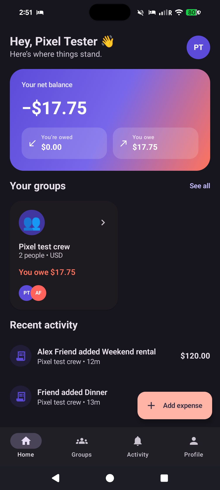
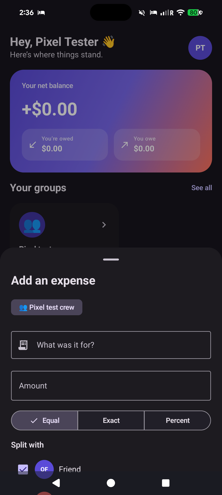
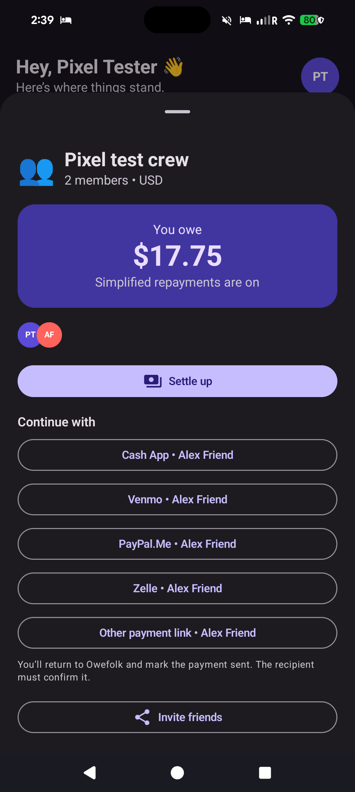

# Owefolk

Owefolk is a native Android shared-expense app for friends. It records a clear, auditable ledger in Firebase, calculates who owes whom using integer money arithmetic, and hands repayments to the payment service people already use. Owefolk never holds funds and never claims an external payment succeeded—the recipient confirms it in the ledger.

[Website](https://chartmann1590.github.io/owefolk/) · [Firebase site](https://owefolk-20260801.web.app) · [Privacy](https://owefolk-20260801.web.app/privacy) · [Delete account](https://owefolk-20260801.web.app/delete-account) · [Releases](https://github.com/chartmann1590/owefolk/releases)

## Real Pixel 8 Pro test

These are screenshots of the production Firebase build running on a connected Pixel 8 Pro. The expenses, members, balance, activity, and settlement shown below are real records in the production Firestore project—not hardcoded demo data.

<p align="center">
  
  
  
</p>

## What ships

- Kotlin, Jetpack Compose, Material 3, edge-to-edge layouts, dynamic light/dark appearance, and Android API 36.
- Firebase Authentication with Google, email/password, and passwordless email-link entry points.
- Cloud Firestore groups, memberships, expenses, equal/exact/percentage splits, activity, invitations, reminders, and recipient-confirmed settlements.
- Deterministic integer-minor-unit math and debt simplification without rewriting financial history.
- Honest Venmo, Cash App, PayPal, Zelle, cash, or custom-link handoff. Payment details are copied and the real provider is opened; no private P2P API is impersonated.
- Firebase Analytics, Crashlytics, Performance Monitoring, Remote Config, Cloud Messaging, and Play Integrity App Check integration with privacy-safe event boundaries.
- Member-scoped Firestore security rules, hashed invite tokens, anonymizing in-app deletion, and a public deletion form backed by a Cloudflare Worker.
- AES-GCM encrypted deletion requests, HMAC duplicate detection, Cloudflare D1 persistence, Worker observability, and no plaintext account email storage.
- Signed APK/App Bundle automation, Android/TypeScript tests, dependency audits, Firebase deployment, and GitHub Pages deployment through GitHub Actions.

## Architecture

```text
Android app
  ├─ Firebase Authentication
  ├─ Cloud Firestore + security rules
  ├─ Analytics / Crashlytics / Performance / Remote Config / FCM
  └─ external payment-app or browser handoff

Public web
  ├─ Firebase Hosting
  ├─ GitHub Pages
  └─ Cloudflare Worker → encrypted payloads in D1
```

The `functions/` package contains tested server-side financial mutation and digest code for a future Blaze-enabled deployment. The current Firebase billing account is closed, so the live core deliberately uses rules-constrained Auth/Firestore client operations and the secret-bearing deletion endpoint runs on Cloudflare Workers.

## Build

Requirements: JDK 17, Android SDK 36, Node.js 22, Firebase CLI, and Wrangler.

```powershell
.\gradlew.bat testDebugUnitTest assembleDebug
Set-Location functions; npm ci; npm run build; npm test; Set-Location ..
Set-Location worker; npm ci; npm run check; Set-Location ..
```

`app/google-services.json` is required and intentionally ignored. Release signing is supplied only through `OWEFOLK_KEYSTORE_PATH`, `OWEFOLK_KEYSTORE_PASSWORD`, `OWEFOLK_KEY_ALIAS`, and `OWEFOLK_KEY_PASSWORD`; no key material is committed.

## Production services

- Firebase project: `owefolk-20260801`
- Android package: `com.charles.owefolk`
- Cloudflare Worker: `https://owefolk-api.charles-h-hartmann1.workers.dev`
- Cloudflare D1: `owefolk-prod`
- GitHub Actions secrets hold the Firebase Android config, signing key, signing credentials, Firebase deploy identity, and Worker encryption key.

## Security and privacy

Telemetry rejects sensitive parameter names and must never contain names, emails, notes, amounts, handles, invite tokens, group IDs, or user IDs. Signing files, Firebase configuration, service-account JSON, local Worker variables, and generated build outputs are ignored. Shared ledger rows survive account deletion only in anonymized form so remaining members retain a coherent history.

Before a Play Store production launch, enable Firebase App Check enforcement after monitoring Play Integrity metrics, complete Play Data Safety and financial-feature disclosures, and run the Play pre-launch/accessibility reports.
