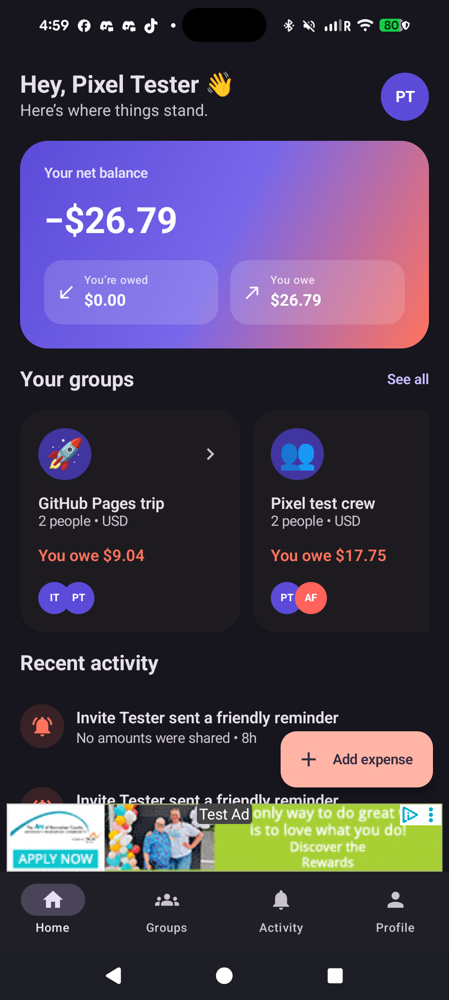
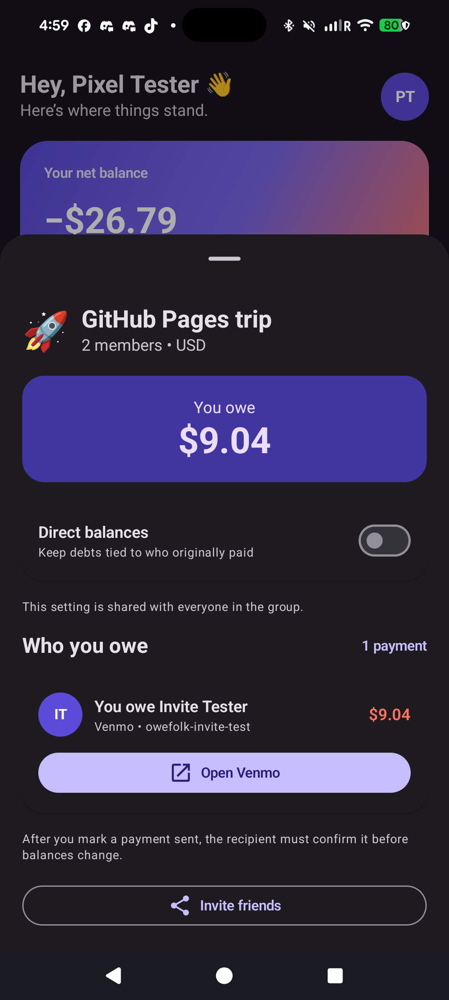
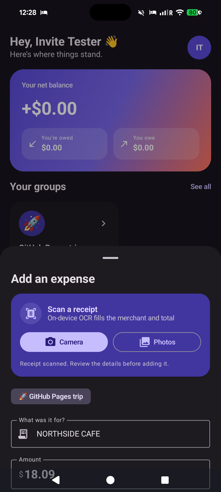
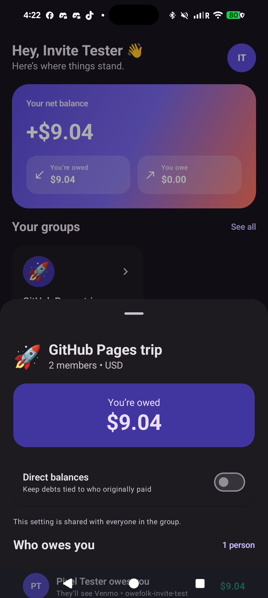

# Owefolk

### Shared tabs. Clear friendships.

Owefolk helps friends, roommates, couples, and travel groups keep shared expenses fair without turning every dinner into a spreadsheet. Add what was paid, choose how to split it, and everyone sees their own up-to-date balance when they sign in.

[Visit the Owefolk website](https://chartmann1590.github.io/owefolk/) | [Download the Android app](https://github.com/chartmann1590/owefolk/releases/latest) | [Read the privacy promise](https://chartmann1590.github.io/owefolk/privacy.html)

## Know exactly where you stand

No guessing and no awkward group-chat math. Owefolk shows what you owe, what you are owed, and the group behind every balance.

  

## Paying someone back feels natural

Open a group to see the person you owe, the exact amount, and the payment method they prefer. Their saved handle is shared with you, so Owefolk can open the right destination in Venmo, Cash App, PayPal, Zelle, or their custom payment link.

  
  

Owefolk never pretends that opening another app means money moved. After paying, the sender marks the payment sent; the recipient confirms it before the shared balance changes.

## From receipt to repaid

1. **Add it quickly.** Type an expense or scan a receipt. Private on-device text recognition suggests the merchant and total for you to review.
2. **Split it fairly.** Divide the cost equally, enter exact shares, or use percentages.
3. **See the real picture.** Keep debts tied to the friend who originally paid, or let the group simplify repayments into fewer transfers.
4. **Settle your way.** Each person saves a preferred payment method and handle. The friend paying them back sees those details automatically.

  
  
  

## Made for real groups

- Live shared groups, invitations, reminders, and activity history
- Clear per-person repayment details for both the person paying and the person receiving
- A group-wide choice between simplified repayments and direct payer relationships
- Receipt scanning that keeps the image and recognized text on your device
- Light and dark themes designed to feel at home on Android
- Account deletion and privacy controls inside the app and on the web

The screenshots above come from the production app running on a connected Pixel 8 Pro with two real Firebase accounts and shared records. They are not hardcoded demo screens. Payment testing uses a clearly labeled QA handle, so no false or unauthorized payment is recorded.

## Get Owefolk

Download the latest signed Android release from [GitHub Releases](https://github.com/chartmann1590/owefolk/releases/latest), or explore the experience on the [Owefolk GitHub Pages website](https://chartmann1590.github.io/owefolk/).

Owefolk tracks shared debts but does not hold, send, receive, or verify money. Payments happen through the services you and your friends choose.
